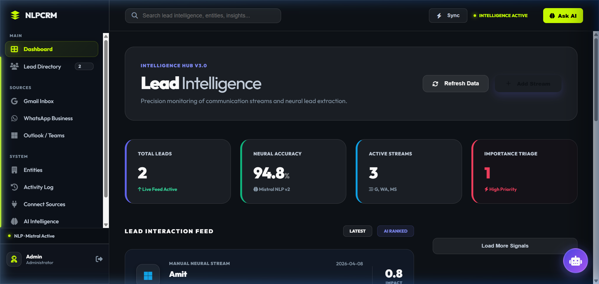
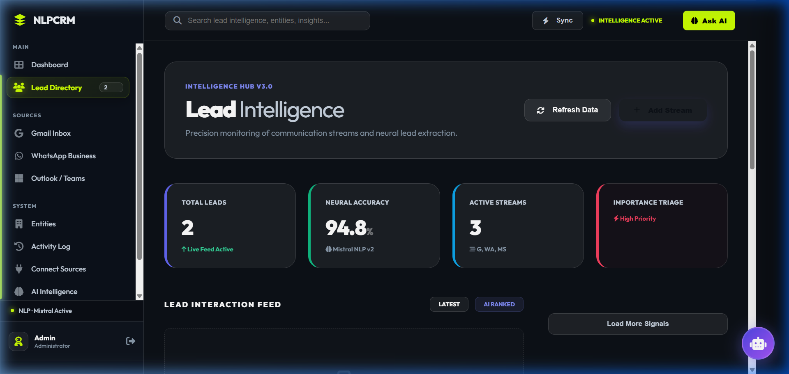

# 🚀 NLPCRM: Next-Gen AI-Powered Customer Intelligence



### *Transforming unstructured conversations into actionable neural intelligence.*

**NLPCRM** is a state-of-the-art Customer Relationship Management system designed for the modern era. It leverages high-performance **Natural Language Processing (NLP)** to ingest, analyze, and structure communication from every major channel—turning raw text into precise business signals.

---

## 💎 Premium Features

### 🧠 Neural Lead Extraction
- **AI-Powered Engine**: Built with Hugging Face (Qwen 2.5) for high-accuracy entity extraction (Name, Email, Company, Intent).
- **Multichannel Ingestion**: Seamlessly sync signals from **WhatsApp Business**, **Gmail**, and **Meeting Transcripts**.
- **Auto-Triage**: Intelligent lead scoring and categorization based on neural sentiment analysis.

### 🎨 Stunning "Neural Indigo" UI
- **Premium Hybrid Design**: A sleek dark-mode aesthetic with high-contrast Action Tokens (Neon Lime & Deep Indigo).
- **Frosted Glassmorphism**: High-end visual depth with real-time blur and sophisticated micro-animations.
- **Intelligence Drawer**: Slide-out neural profiles for deep-diving into individual lead signals without losing context.

### 📱 Enterprise Mobility (PWA)
- **Installable Desktop/Mobile**: Full Progressive Web App support—install NLPCRM as a native application.
- **Offline Reliability**: Service Worker integration for high-speed local caching and reliable access.

### 🤖 CRM Chat Analyst
- **Interactive AI Assistant**: Query your customer database using natural language (e.g., *"Find me high-interest leads from TechCorp"*).
- **Real-time Analytics**: Ask the AI for complex data summaries and trend analysis.

---

## 🖼️ Visual Showcase

| Dashboard Intelligence | Neural Directory |
| :--- | :--- |
|  |  |

---

## 🏗️ Tech Stack

- **Core**: Python 3.9+ / Flask Enterprise
- **Database**: Hybrid SQLite Cloud with Local Fallback
- **Artificial Intelligence**: Hugging Face Inference API (Qwen 2.5 Architecture)
- **Frontend Architecture**: Modern JavaScript / Premium Vanilla CSS Tokens / Jinja2
- **Security**: Google OAuth 2.0 / Talisman (Advanced CSP) / CSRF Protection

---

## 🛠️ Quick Start

### 1. Environment Setup
Clone the repository and initialize the virtual environment:
```powershell
# Windows
python -m venv .venv
.venv\Scripts\activate
pip install -r requirements.txt
```

### 2. Configuration (`.env`)
Create a `.env` file in the root directory:
```env
# AI & Database
SQLITE_CLOUD_URL=your_sqlite_cloud_url
HF_API_KEY=your_huggingface_key

# Authentication
GOOGLE_CLIENT_ID=your_google_id
GOOGLE_CLIENT_SECRET=your_google_secret
SECRET_KEY=generate_a_secure_random_key

# Admin Defaults
ADMIN_PASSWORD=admin@2026
```

### 3. Launching
```powershell
python run.py
```

---

## 🧪 Verification & Testing
A comprehensive test suite is included to ensure production stability.
- **Test Sheet**: Refer to `NLPCRM_Test_Cases.xlsx` for 20+ verified test scenarios.
- **System Check**: Run `scripts/validate_backend.py` to verify API connectivity.

---

## 🤝 Project Developer

**Aman Varma**  
*Full Stack Developer & AI Specialist*

- 📧 **Email**: [amangurauli@gmail.com](mailto:amangurauli@gmail.com)
- 💼 **LinkedIn**: [Aman Varma](https://www.linkedin.com/in/aman-v-697771345/)
- 🐙 **GitHub**: [@Amanvarma2231](https://github.com/Amanvarma2231)

---
*Developed with a focus on Enterprise Intelligence and UI Excellence.*
